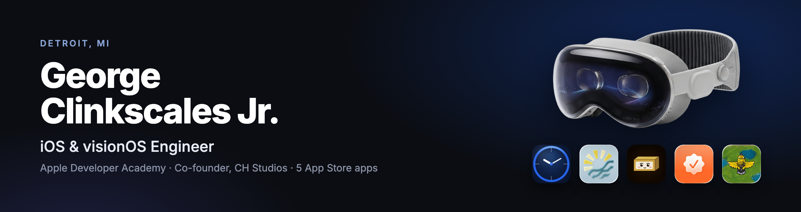
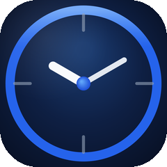
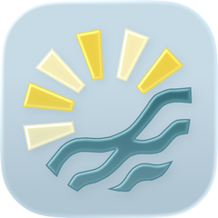
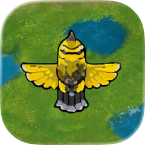
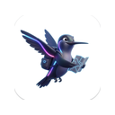

 

 

&nbsp;

&nbsp;

 
 

        

 
 

<picture>
  <source media="(prefers-color-scheme: dark)" srcset="https://raw.githubusercontent.com/geoClink/geoClink/output/github-contribution-grid-snake-dark.svg" />
  
</picture>

 

## 🥽 &nbsp;Right Now

| &nbsp; | Role | What I'm doing |
|---|---|---|
| 🥽 | **visionOS Developer** · MSU Apple Developer Academy, Renaissance Program | Building a Vision Pro healthcare app for a real clinical client with a team of 5, in visionOS, SwiftUI, and RealityKit. *Details confidential.* |
| 🔩 | **Software Development Intern** · Sort-Tek Inspection Systems | Co-building an iPad inspection app for fastener sorting with on-device machine learning. The project is now an [MSU CSE senior capstone](https://capstone.cse.msu.edu/2026-08/projects/sort-tek/); I helped write the curriculum and advise the 5-student team. |
| 🏗 | **Co-Founder** · CH Studios LLC | Detroit software studio with [Jaiden Henley](https://github.com/jaidenhenley), shipping iOS, Android, and web for [Tripsetta](https://tripsetta.com). |

## 📱 &nbsp;Shipped Apps

> **Five apps live on the App Store.** Squishy Butter is also on Google Play and the web.

<table width="100%">
  <tr>
    <td align="center" width="20%"> <b>Tally</b> </td>
    <td align="center" width="20%"> <b>CoastCast</b> </td>
    <td align="center" width="20%"> <b>Squishy Butter</b> </td>
    <td align="center" width="20%"> <b>Stamped!</b> </td>
    <td align="center" width="20%"> <b>TakeFlight</b> </td>
  </tr>
</table>

| &nbsp; | App | Stack | Links |
|---|---|---|---|
| ⏱ | **Tally — Time Tracker** · *Cross-platform SaaS — iPhone, Watch, Mac via Catalyst, React web dashboard, Android in closed testing. StoreKit + Stripe write the same `is_pro` flag. $9.99 one-time.* | SwiftUI · Catalyst · React · Supabase · StoreKit · Stripe | [App Store](https://apps.apple.com/us/app/tally-time-tracker/id6775275483) · [Web](https://tallytimetracker.com) · [GitHub](https://github.com/geoClink/tally-web) |
| 🏖 | **CoastCast — Beach Conditions** · *Real-time conditions for 54 Michigan beaches. XGBoost Crowd Meter on-device via CoreML. WidgetKit, Live Activities, Siri Shortcuts.* | SwiftUI · FastAPI · CoreML · XGBoost · WidgetKit | [App Store](https://apps.apple.com/us/app/coastcast/id6760917476) · [GitHub](https://github.com/jaidenhenley/MichiganAPIWeather) |
| 🏛 | **Stamped! — City Passport** · *Collect digital passport stamps at architectural landmarks. Offline-first, VoiceOver, 8 languages, Apple Intelligence itinerary planner (iOS 26+).* | SwiftUI · UserDefaults · App Intents | [App Store](https://apps.apple.com/us/app/stamped-a-city-passport/id6759680336) · [GitHub](https://github.com/geoClink/Stamped-A-City-Passport) |
| 🐦 | **TakeFlight — Bird Survival Game** · *5-in-1 survival game set on Belle Isle, Detroit. Custom SwiftUI joystick, Game Center leaderboards. Team of 5 at the Academy.* | SwiftUI · SpriteKit · SwiftData · Game Center | [App Store](https://apps.apple.com/us/app/takeflight-a-bird-life/id6758803964) · [GitHub](https://github.com/jaidenhenley/TakeFlight) |
| 🧈 | **Squishy Butter** · *A stick of butter you squish with your finger — real-time soft-body deformation in a custom GLSL vertex shader, 160+ collectible skins. One codebase shipped to iOS, Android, and the web, with a Supabase backend for purchases, push notifications, and an admin dashboard.* | GLSL · Three.js · Capacitor · Supabase · Stripe · RevenueCat | [App Store](https://apps.apple.com/us/app/squishy-butter/id6801368552) · [Google Play](https://play.google.com/store/apps/details?id=com.squishybutter.app) · [Web](https://squishybutter.app) · [Case Study](https://georgeclinkscalesdev.com/squishy-butter.html) |

<table width="100%">
  <tr>
    <td align="center" width="50%">
      
       <b>Tally</b> — live on the App Store
    </td>
    <td align="center" width="50%">
      
       <b>CoastCast</b> — live on the App Store
    </td>
  </tr>
  <tr>
    <td align="center" colspan="2">
      
       <b>Squishy Butter</b> — custom GLSL soft-body physics, live at squishybutter.app
    </td>
  </tr>
</table>

## 🏢 &nbsp;Client Work

> **Real businesses, live in production — not demos.**

| &nbsp; | Client | What I built | Links |
|---|---|---|---|
|  | **White Bear Harmonics** | Michigan energy healing and acupuncture practice — live and taking real bookings and payments on Small Business Suite. Onboarded with zero code changes. | [Live Site](https://whitebearharmonics.com) · [Case Study](https://georgeclinkscalesdev.com/wellness-co.html) |
|  | **Crystal Lake Resort** | Michigan lakefront resort with motel rooms and weekly cottages — direct bookings, Stripe checkout, and gift cards on Small Business Suite. | [Live Site](https://crystallakeresortmi.com) · [Case Study](https://georgeclinkscalesdev.com/inn-co.html) |
|  | **Tripsetta** | Cross-platform engineer (part-time contract) — maintaining and shipping feature updates across the travel platform's iOS, Android, and web apps. | [Site](https://tripsetta.com) · [Case Study](https://georgeclinkscalesdev.com/tripsetta.html) |
|  | **Sort-Tek Inspection Systems** | Bespoke marketing site for a Troy, MI ISO 9001:2015-certified fastener inspection company. 100/100 Lighthouse on mobile and desktop. | [Live Site](https://www.sort-tek.com) · [Case Study](https://georgeclinkscalesdev.com/sort-tek.html) |
|  | **Emmalee Alexander · Print Design** | Portfolio site for a Frankfort, MI print designer — filterable work gallery, pricing, reviews, and a no-code admin panel. Vanilla HTML/CSS/JS. | [Case Study](https://georgeclinkscalesdev.com/emmalee-print-design.html) |

<table width="100%">
  <tr>
    <td align="center" width="50%">
      
       <b>White Bear Harmonics</b> — live and taking bookings
    </td>
    <td align="center" width="50%">
      
       <b>Crystal Lake Resort</b> — live and taking direct bookings
    </td>
  </tr>
  <tr>
    <td align="center" width="50%">
      
       <b>Sort-Tek Inspection Systems</b> — 100/100 Lighthouse
    </td>
    <td align="center" width="50%">
      
       <b>Emmalee Alexander</b> — print designer portfolio
    </td>
  </tr>
</table>

## 🧩 &nbsp;Small Business Suite

> **The platform behind the client work above.** One backend, one codebase, every client a database row.

A multi-tenant SaaS platform with booking, payments, staff scheduling, loyalty, and admin dashboards — **two real businesses live in production, six demo verticals**. Per-tenant Stripe keys live in the database so adding a client never requires a backend redeploy. 130 passing tests · Sentry in production.

&nbsp;

| &nbsp; | Project | What it does | Links |
|---|---|---|---|
| 🎂 | **The Bakery Co.** | Ordering platform — menu CMS, inventory, loyalty, gift cards, subscriptions, webhook-first Stripe checkout. MCP server lets customers order through Claude. | [Demo](https://the-bakery-co.vercel.app) · [Case Study](https://georgeclinkscalesdev.com/bakery-spec.html) |
| 🌿 | **The Wellness Co.** | Booking platform — Stripe checkout, tiered refund logic via UUID cancel tokens, JWT-protected admin. The template White Bear Harmonics runs on. | [Demo](https://the-wellness-co.vercel.app) · [Case Study](https://georgeclinkscalesdev.com/wellness-co.html) |
| 🏨 | **The Inn Co.** | Hotel booking — per-room availability calendar, Stripe checkout, admin dashboard with bookings, revenue, and occupancy tracking. The template Crystal Lake Resort runs on. | [Demo](https://the-inn-co.vercel.app) · [Case Study](https://georgeclinkscalesdev.com/inn-co.html) |
| 🍺 | **The Sports Bar Co.** | Reservations and events — table booking writes to Supabase, events calendar is owner-managed, party inquiries route to inbox. | [Demo](https://the-sports-bar.vercel.app) · [Case Study](https://georgeclinkscalesdev.com/sports-bar-co.html) |
| ✂️ | **The Salon Co.** | Luxury hair studio site — services, stylist profiles, gallery, booking, employment page. No framework, no CMS. Lighthouse 100 across the board. | [Demo](https://the-salon-co.vercel.app) · [Case Study](https://georgeclinkscalesdev.com/salon-co.html) |
| 🌱 | **The Landscape Co.** | Multi-page garden design studio site — vanilla HTML/CSS/JS with a live contact form wired to the Suite backend. | [Demo](https://landscape-co-ten.vercel.app) · [Case Study](https://georgeclinkscalesdev.com/landscape-co.html) |

<table width="100%">
  <tr>
    <td align="center" width="34%">
      
       <b>The Bakery Co.</b>
    </td>
    <td align="center" width="33%">
      
       <b>The Inn Co.</b>
    </td>
    <td align="center" width="33%">
      
       <b>The Salon Co.</b>
    </td>
  </tr>
</table>

## 🤖 &nbsp;AI Engineering

| &nbsp; | Project | What it does | Links |
|---|---|---|---|
| 🏀 | **Detroit Sports Chatbot** | AI agent with 15 live ESPN tools, dual-provider support (Claude + Groq), Whisper voice input, and an automated eval pipeline that improved response quality 28%. Deployed on Render. | [Live](https://detroitsportchatbot.onrender.com) · [Case Study](https://georgeclinkscalesdev.com/detroit-sports-chatbot.html) |
| 🔊 | **Local LLM Speaker** | Private, offline smart speaker built from scratch — Raspberry Pi 5 running Whisper STT, Ollama + Qwen3, and Piper TTS, with MCP tools and a web dashboard. Custom ESP32-S3 PCB firmware streams wake-word audio over WebSocket. No cloud, no voice data leaving the network. | [GitHub](https://github.com/geoClink/local-llm-speaker) · [Firmware](https://github.com/geoClink/local-llm-speaker-firmware) |

## 🎨 &nbsp;Brand & Web Design

| &nbsp; | Project | What it does | Links |
|---|---|---|---|
| 🌿 | **Botanical Archive** | Brand landing page for a craft hemp beverage company, built in 5 days — Three.js interactive 3D model viewers, parallax animation, zine-style editorial design. | [Live](https://beverage-webpage.vercel.app) · [Case Study](https://georgeclinkscalesdev.com/beverage-co.html) |

## 🔀 &nbsp;Open Source

| PR | Project | What I changed |
|---|---|---|
| [#14864](https://github.com/streamlit/streamlit/pull/14864) | **Streamlit** | CSS-in-JS border-radius and overflow fixes for video and chart components |
| [#37](https://github.com/HandmadeNetwork/hmn/pull/37) | **Handmade Network** | Refined project blog index logic for single-post states; audited typography utility classes |
| [#4650](https://github.com/TandoorRecipes/recipes/pull/4650) | **Tandoor Recipes** | Added missing Back button to Ingredient Editor, matching Vue 3 navigation patterns |

## ⚡ &nbsp;Recent Activity

<!--START_SECTION:activity-->
<!--END_SECTION:activity-->

## 🛠 &nbsp;Tech Stack

**Web & Backend**

          

**iOS & Mobile**

  

**Tools & Infra**

      

 

**Co-Founder · CH Studios** *(Detroit software studio — mobile apps & full-stack products)*
&nbsp;·&nbsp;
**Cross-Platform Engineer · [Tripsetta](https://tripsetta.com)** *(part-time contract)*
&nbsp;·&nbsp;
**MSU Apple Developer Academy · Year 2 · Sep 2026 – May 2027** *(25 of 240 selected from year one)*

 

**Open to iOS and full-stack roles in Detroit or remote**

 

